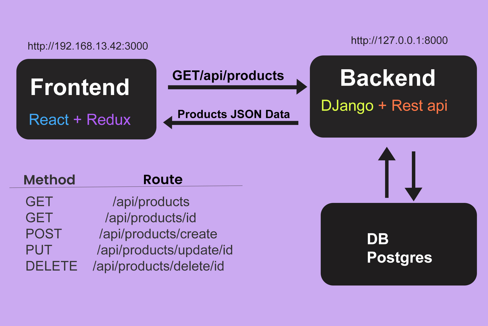

# PROJET MERCADONA
## Listes des technologies et configuration
1. virtual env install 
2. pip install django
3. React app install 
4. https://bootswatch.com/ Free themes for Bootstrap
5. https://react-bootstrap.github.io/ for materials ui
6. https://cdnjs.com/libraries/font-awesome  font-awesome
7. React router dom install 
8. https://www.django-rest-framework.org/ API
9. Npm install axios : https://axios-http.com/fr/docs/api_intro
10. https://pypi.org/project/django-cors-headers/
11. pip install Pillow : for image upload Django
12. Admin.py : register the model. Product
13. serializers data 
14. React Redux: create redux Store
15. https://jwt.io/ :JSON Web Tokens
16. Json web installation 
17. Django rest api / authentification 
18. TokenAuthentication / rest_framework.authtoken'
19. Simple JWT documentation
20. Django signals
21. Paypal
22. React-paypal-button-v2

## 1. Les fonctionnalités attendues
Pour le projet Mercadona  nous devons intéresser à trois aspects d’user story : 
En tant que client récurrent, il souhaite que la présentation des produits à la gestion de la transaction, en passant par le tunnel d'achat et les fonctionnalités de promotion commerciale (utilisation de coupons de réduction ou gestion des offres spéciales) gestion des stocks, des commandes, et des livraisons soient sauvegardées afin que l’expérience de promotion et paiement soient plus fluide 
## 2.  Les éléments à sécurité :  
Se conformer à toutes les contraintes de sécurité et de suivi de la relation client cette solution sera connecter à un système de gestion de contenu (Django administration) permettant de gérer toutes les informations relatives à la relation avec la clientèle et une logique de sécurité est obligatoire pour les utilisateurs qui passent des commandes, mais aussi des formulaires de paiement et la livraison d’utilisateur identifié en utilisant les instructions de contrôle comme : 
- [x] If  
- [x] Else,  
- [x] Try  
- [x] Catch 
- [x] Except …  
En parlant de sécurité technique :  
Le protocole https désigne simplement la version sécurisée de l’habituel http, 
Les accès inutiles fermés : Il faut bien sûr les connaître, savoir si ces possibilités sont ouvertes ou fermées et le cas échéant qui y a accès, vérifier que le login et le mot de passe y a accès

## 3. Les choix techniques:
les développements représentent environ les deux tiers de la charge facturée. La partie ou 
les clients émettent des demandes (les requêtes api) auxquelles répondent le serveur. Pour cette application 
en particulier, on fera en deux familles distinctes : django-rest-framework API côté serveur et reactJs côté 
client et css pour la mise en forme des pages 

   
- [x] Côté serveur : 
qui permettra notamment de générer des pages à la volée à partir des requêtes api des utilisateurs et 
des informations stockées dans des bases de données.  
Django-rest-framework la partie du business logique:
* Les modelés : fournissent une couche d'abstraction pour structurer et manipuler les données  
* Des vues : pour encapsuler la logique responsable du traitement de la demande d'un utilisateur et du retour de la réponse. 
* Url : c'est l'algorithme que le système suit pour déterminer quel code exécuter
#### Rest_framework_api (Interface de programmation d'applications) est un ensemble de méthodes :
* GET 
* POST 
* PUT 
* DELETE...  
En passant par la sérialisation qui définissent comment les données de la base peuvent se connecter et communiquer entre le frontend 
* TokenAuthentication: 
qui me permet de gérer la création de compte et inscription des utilisateurs et administrateur du site  

Postman pour connecter les api 

- [x] Côté client : 
React JS framework de javascript qui facilite la création d'interface 
React Router une bibliothèque de routage standard dans react. 
Il rend l'interface de l'application synchrone avec l'URL du navigateur et de router clairement le flux de données.  
React Redux est une bibliothèque indépendante qui nous aide à gérer notre état en donnant à nos composants l'état dont il a besoin via un store  
 
  
- [x] Explications : 
J'ai ici un schéma simple avec juste quelques concepts et parties différents de Redux 
Nous avons un état au niveau du composant et nous avons un état global également appelé état de l'application. 
L'état au niveau du composant concerne un composant spécifique. 
Exemples : de choses que nous pourrions avoir dans notre état global sont l'utilisateur authentifié. 
Ainsi, lorsque nous nous connectons, nous voulons avoir accès aux données des utilisateurs qui seront conservées dans l'état, les achats, les articles du panier, les commandes, des trucs comme ça, tout cela serait dans l'état global. 
Vous savez ce qu'est le serveur, c'est notre back-end  donc la façon dont cet état est modifié se fait par des réducteurs ou des fonctions de réduction et cela ne fonctionne essentiellement qu'à l'exception des actions. 
Et ils sont responsables de la manipulation et de la transmission de l'état aux composants. 
Les actions ne sont que des objets qui représentent l'intention de changer un élément d'état. 
Nous avons également des créateurs d'action, qui sont des fonctions qui répartiront ou déclencheront ces actions. 
Exemple, nous pouvons avoir une fonction de créateur d'action appelée Get Products. 
Et dans ce créateur d'action, nous faisons une demande au back-end pour obtenir des données à l'aide d'Axios ou de l'API. 
Peu importe, puis nous récupérons ces données, puis nous envoyons une action au réducteur et nous attachons une charge (payload) utile pour elle. 
Et cette charge (payload) utile contiendra les données de récupération. 
Maintenant, dans le réducteur, nous pouvons affecter ces données de charge utile à l'état et nous pouvons les transmettre à tous les composants qui le demandent. 
Quand nous avons besoin que quelque chose se produise, comme disons que nous voulons cliquer sur un bouton et récupérer des données depuis le serveur puis l'afficher, il faut créer une action ou un créateur d'action pour envoyer une action spécifique au réducteur, puis le réducteur la transmet au composant. 

Redux, est la bibliothèque de gestion d'état, 
Thunk nous permet simplement de faire une demande asynchrone de nos créateurs d'action. C'est un peu comme un middleware pour notre magasin.  
Donc outils de développement redux, extensions c'est cette bibliothèque qui va en fait nous permettre de connecter notre boutique à cette extension de navigateur.  
Et ici, la première chose qui importera sera de créer des magasins c'est la fonction qui crée notre magasin.  
Le prochain sera des réducteurs combinés. Alors combinez les réducteurs. 
Ce que cela fait, c'est que plus tard, nous aurons plusieurs réducteurs pour différentes parties de notre application, va prendre tous ces réducteurs et va les combiner en un seul réducteur. 
Ensuite, nous allons prendre ce réducteur et l'appliquer à notre magasin.  
Il va donc simplement combiner tout cela dans un seul grand réducteur. 
Et puis nous voulons aussi appliquer le middleware, 
Et la dernière chose que je veux faire est d'ajouter cette fonction qui applique notre magasin à l'outil de développement Redux, 
Donc, notre magasin utilisera simplement une fonction de création de magasin et nous définirons simplement créer un magasin et cette fonction va prendre en compte plusieurs paramètres. 
Enfin Css react-bootstrap: materials ui et font-awesome pour gérer l'apparence du contenu pour mettre en forme les pages sur le Web.  

# 4. DATABASES:postgresql
### Ce capture demontre mon paramettrage de postgreSQL comme base de donnée 
A noter que : 
Tous ces informations n'affichiront pas au moment du deployement mais seront remplaceé par des appels de variables simple raison la securité.  

   
   
#### Et voila l'affichage des donnés appliqués a la base 

lors du deployement de mon site sur Heroku j'ai utilise sqlite3 pour echapper la facturation imposée par Heroku

## 5. Manuel d’utilisation
Cette application permet une identification unique aux membres de l’administration et peuvent modifier ou supprimer des articles et un Button pour créer des articles et peuvent affichagee tous les commandes.

Déploiement en ligne :
<a href="https://mercadonashop.herokuapp.com/#/">www.mercadonastudy.com</a>

